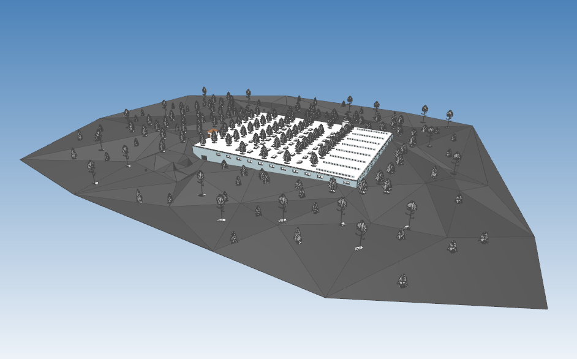
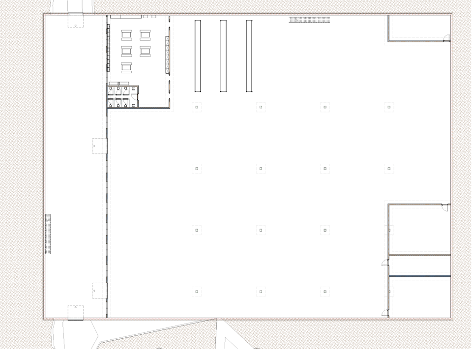

# Factory Planning – Model Classification

---

## 📋 Overview

This chapter classifies the Santa Factory simulation model in the context of factory planning and describes the planning phase, methodological foundation, and project scope.

---

## 📐 Classification according to VDI 5200

The project represents an early phase of factory planning according to **VDI 5200** and is assigned to the following planning phases:

### Planning Phase 0 – Goal Definition and Project Preparation

**Objective:** Definition of overarching goals and strategic direction of the factory planning project

**Activities:**
- Definition of project scope
- Identification of stakeholders
- Analysis of business objectives
- Definition of preliminary goals

**Results:**
- Project charter
- Stakeholder analysis
- Initial project plan

### Planning Phase 1 – Baseline Assessment

**Objective:** Collection of all necessary information about the current state and requirements for the new or modified factory

**Activities:**
- Analysis of existing facilities, processes, and material flows
- Assessment of personnel and technology requirements
- Detailed data collection

**Results:**
- Detailed as-is analysis
- Comprehensive requirement specification
- Preliminary site analysis

---

## 🎯 Planning Status and Focus

### Components of the Planning Status

- **Definition and number of production processes:** Specification of required process steps
- **Basic spatial arrangement:** Positioning within predefined factory areas
- **Production quantity estimation:** Consideration of dynamic system effects

### Deliberate Scope Limitation

The model does **NOT** include:

- Detailed layout planning of individual facilities
- Detailed material flow design
- Design of utilities and energy supply
- Static, structural, or constructional details

**Rationale:** These aspects are assigned to later planning phases (Phase 3-4 of VDI 5200) and require a higher level of detail.

---

## 🏭 Scenario and Brownfield Planning

### Initial Situation

Santa Claus has an **existing factory layout** that is to be reused. This corresponds to a **brownfield planning** situation, where planning occurs within existing structures.

### Use of the IFC Model

The IFC model serves exclusively as a **spatial framework** for positioning production processes. It does not represent a complete or detailed factory plan, but enables:

- Investigation of capacity and throughput questions
- Realistic spatial constraints
- Visualization of process arrangement

---

## 👤 Role of Users

### Task

As a planner or simulation expert, you support Santa Claus with a short-term production decision. A new AI-based toy is to be produced in large quantities shortly before Christmas.

### Objective

Assessment of the extent to which a targeted production quantity can realistically be achieved and what impact different planning decisions have on throughput and system behavior.

### Degrees of Freedom

- Configuration and arrangement of production processes within the predefined layout
- Definition of target production quantity
- Adjustment of selected process parameters

---

## 🔄 Simulation as a Planning Tool

### Application of Discrete Event Simulation

Simulation is used as a supporting tool for early factory planning. It abstracts temporal and dynamic processes to gain insights into system behavior.

### Advantages of Simulation

- **Dynamic Effects:** Capture interactions, waiting times, and disturbances
- **Scenario Comparison:** Evaluation of different configurations
- **Risk Reduction:** Identification of bottlenecks before implementation
- **Transparency:** Traceable decision-making basis

---

## 📊 BIM Terminology and Information Need

### Level of Information Need (LOIN)

The project uses BIM concepts to classify information needs:

- **LOIN:** Defines the required information need for the early planning phase
- **Principle:** "As much as necessary, as little as possible"

### Level of Detail (LOD) and Level of Information (LOI)

- **LOD 100:** Conceptual geometric representation (blocks, simple shapes)
- **LOI 100:** Basic alphanumeric information (process count, sequence, simple time assumptions)

These low levels of detail correspond to the early planning phase and enable strategic decisions without excessive modeling effort.

---

## 📚 Methodological Framework

### VDI 5200 – Factory Planning

Structured seven-phase process from goal definition to ramp-up and operation. The project focuses on phases 0 and 1.

### VDI 3633 – Simulation

Standardized terms and definitions for simulation of logistics, material flow, and production systems. Ensures clarity and consistency in simulation application.

---

## ✅ Summary

The Santa Factory simulation model is deliberately positioned in the early planning phases of factory planning. It focuses on:

- Basic process structure and count
- Capacity estimation under dynamic conditions
- Scenario comparison for decision support

It deliberately omits detailed technical design to authentically represent the character of the early planning phase.

---

**Further Information:**
- [03_product-and-process](./03_product-and-process.md) – Product type and production processes
- [04_model-and-simulation](./04_model-and-simulation.md) – Simulation model structure
- [Glossary](./glossary.md) – Technical terms

 
**Date:** December 2025
