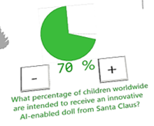
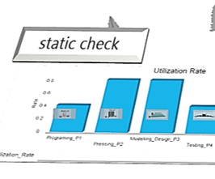
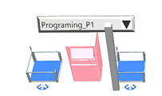
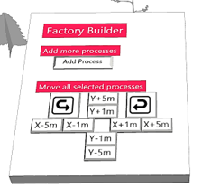

# Configuration Options

---

## Step 1: Demand Planning 

**How many presents are needed?** There are roughly 2 billion children on this planet.

Decide how many of them were well-behaved and should receive a present.

---

## Step 1: Demand Planning 

**How many presents are needed?** There are roughly 2 billion children on this planet.

Decide how many of them were well-behaved and should receive a present.

---

## Step 2: Check the Capacity of Santa's Factory

Manufacturing the AI-enhanced dolls requires **6 process steps**.

Run a static check to see the expected utilization based on the process time and number of stations per process.

---

## Step 3: Factory Planning 

Open the roof of Santa's Factory with the button, to see inside. 

Use the **Factory Builder** to insert more stations if needed and set or change their process type with the dropdown menu. 

Select stations to move them around on the shop floor. Make sure all workplaces are accessible for the Elves (press **O** to see obstacles)!

---

## Step 4: Go-Live of Production!

Once you are satisfied with your factory, start the simulation with the **EventController**. Observe the production process.

Watch out for Santa and his reindeers as they fly out to deliver batches of presents!

Under the Christmas tree, you can track your progress.

